# AI Coding Workflow

Fuzzy idea → spec → stages → phased plan → PR → reviewed merge.

**Each skill is unaware of the others — drop into either flow at any node with whatever artifacts you already have.**

---

## Build flow

| Skill | When | What it does |
|---|---|---|
| `grill-me` | Start with a fuzzy idea | Asks clarifying questions from the **user's perspective only** (UI / external API). Ends with shared understanding. |
| `to-functional-spec` | After grilling | Dumps the conversation into `functional-spec.md`. |
| `to-stages` | After spec | Splits the spec into ordered, dependent stages. |
| `drill-down` | Per stage *(loops)* | First **technical** pass — types, interfaces, algorithms. Asks questions until aligned. |
| `to-phased-plan` | After drill-down | Writes a phased plan doc with code snippets and commit breakdown. |
| `to-implementation` | Per phase *(loops)* | Implements one phase and opens a PR (uses `stack-prs` to stack). |

### Workflow split by perspective (user vs technical), with per-stage and per-phase loops.

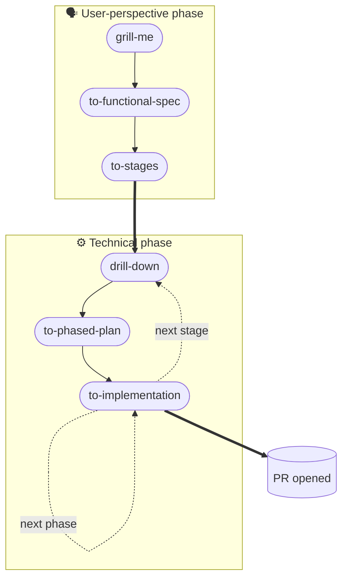

### Effort per step, labeled by actor (you vs AI).

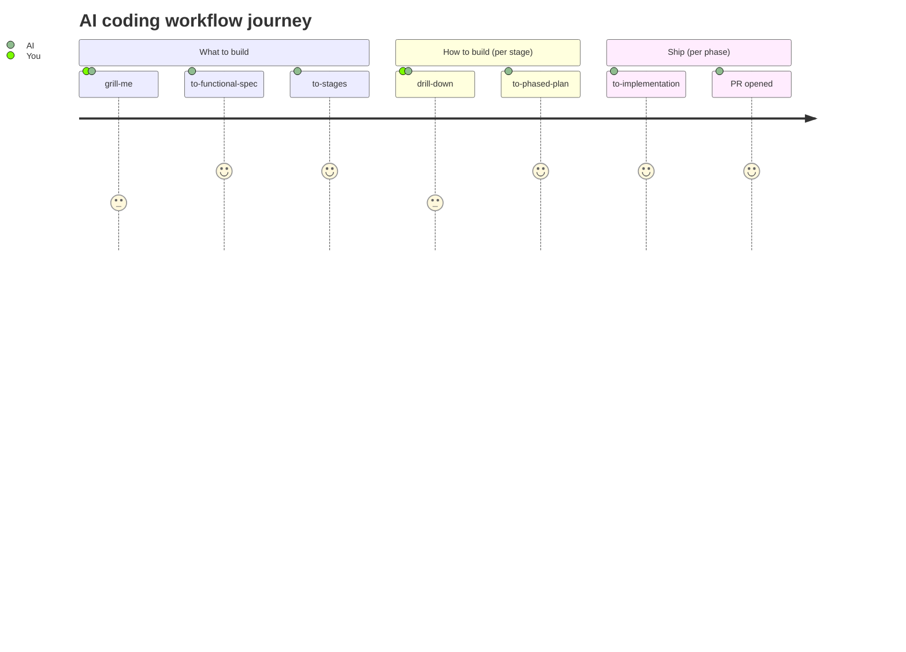

<details>
<summary><b>Other build-flow diagram styles (do not open)</b></summary>

#### Original — left-to-right with explicit loop subgraphs

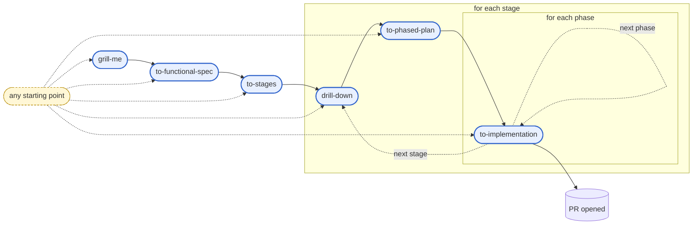

#### Sequence diagram (you ↔ skills)

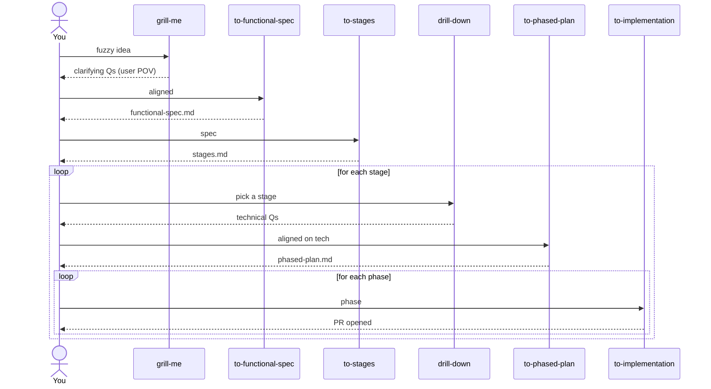

#### State diagram with explicit loop edges

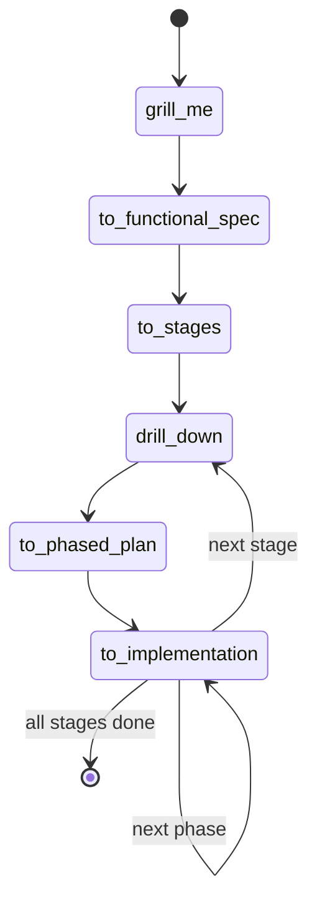

#### Mindmap (taxonomy view)

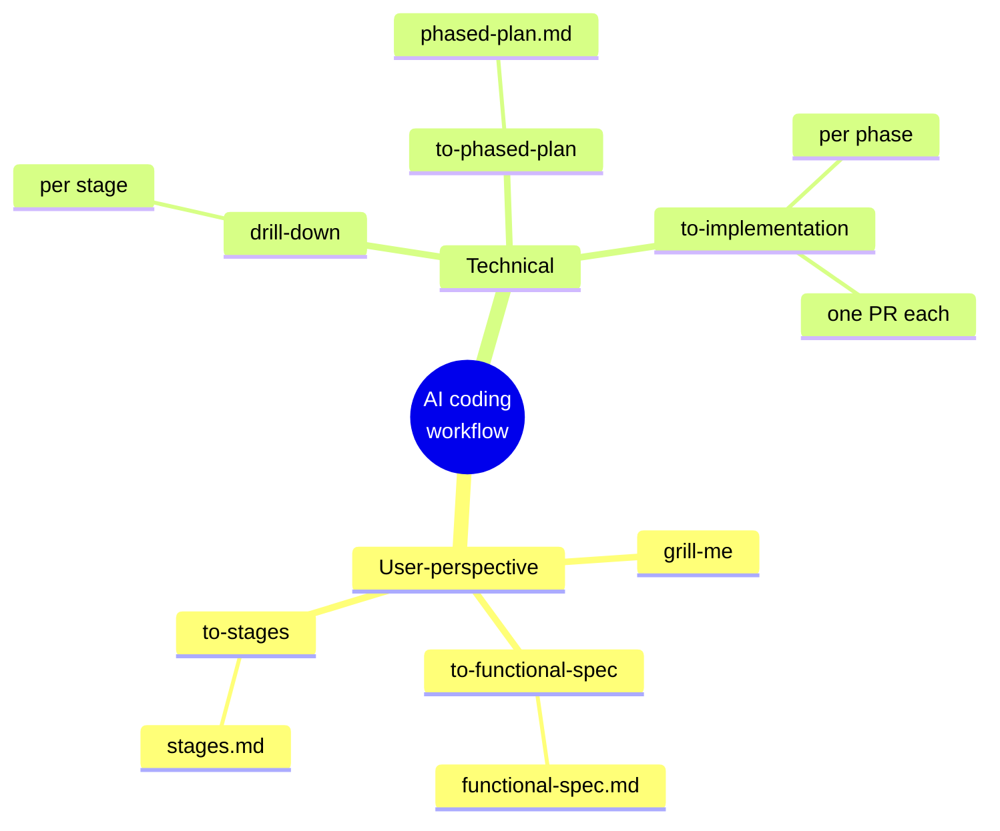

#### Gantt (ordering through stages & phases)

```mermaid
gantt
    title Build flow ordering
    dateFormat  X
    axisFormat  %s
    section Spec
    grill-me                  :a1, 0, 1
    to-functional-spec        :a2, after a1, 1
    to-stages                 :a3, after a2, 1
    section Stage 1
    drill-down                :b1, after a3, 1
    to-phased-plan            :b2, after b1, 1
    to-implementation phase 1 :b3, after b2, 1
    to-implementation phase 2 :b4, after b3, 1
    section Stage 2
    drill-down                :c1, after b4, 1
    to-phased-plan            :c2, after c1, 1
    to-implementation phase 1 :c3, after c2, 1
```

#### gitGraph (PR stack as commits)

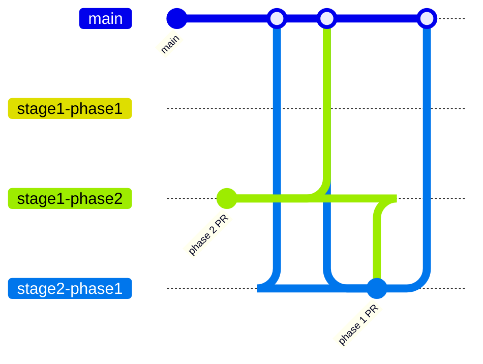

#### Class diagram (skills as units with I/O)

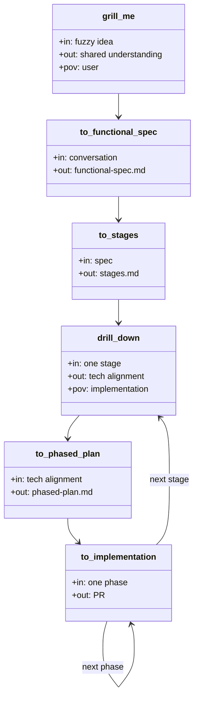

#### Timeline (phases as eras)

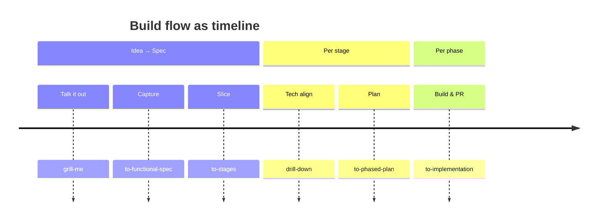

#### Two-column flow with shared "any-entry" rail

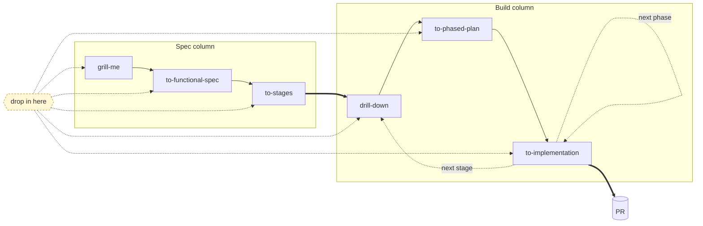

</details>

---

## Review flow

| Skill | When | What it does |
|---|---|---|
| `architecture-review` | After PR opens | High-level review; flags issues. You paste findings as PR comments. |
| `address-review` | After comments | Reads PR comments, asks for clarifications if needed, plans, then commits each change linked to its comment. |

### Your comments and `architecture-review` comments merge into `address-review`.

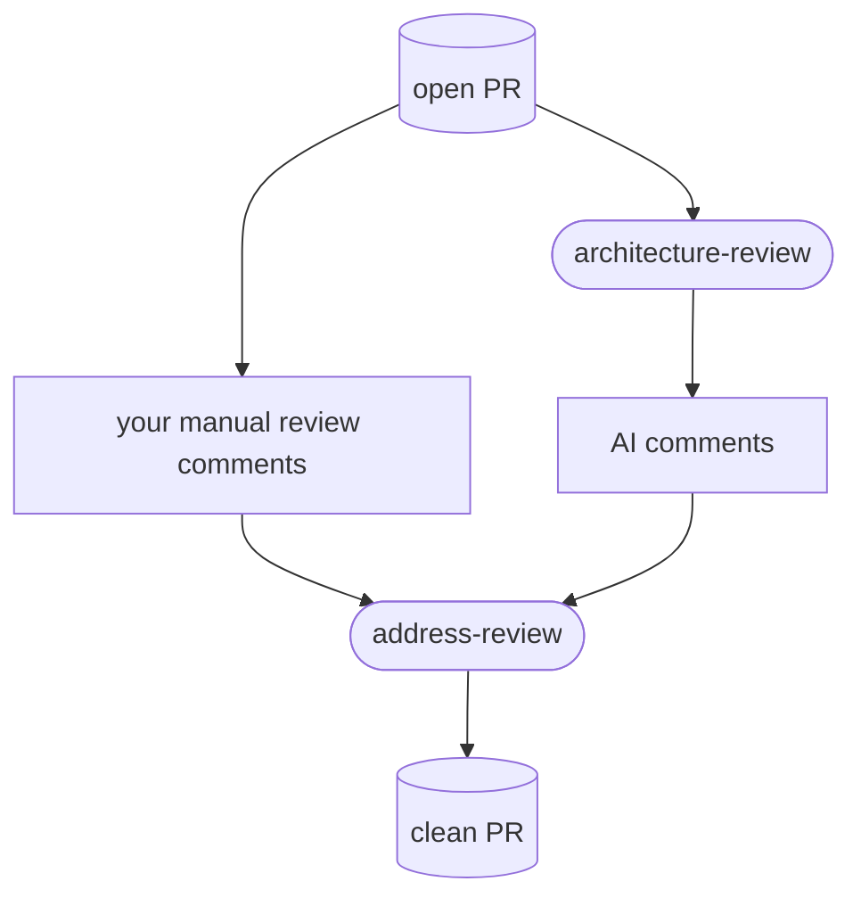

### Effort per step, labeled by actor (you vs AI).

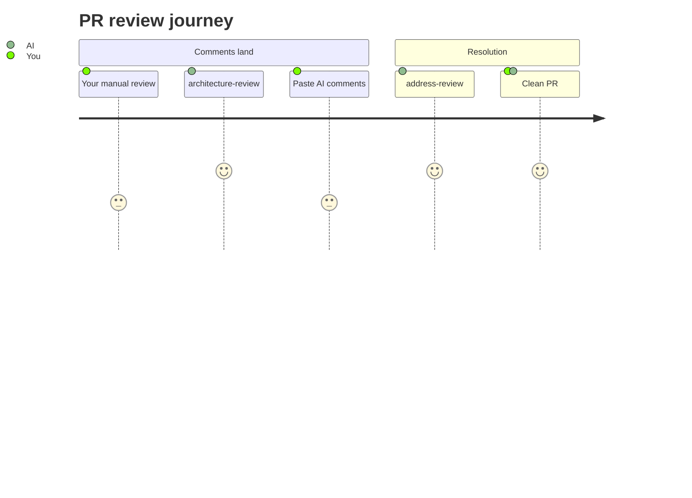

<details>
<summary><b>Other review-flow diagram styles (do not open)</b></summary>

#### Original — left-to-right with any-entry rail

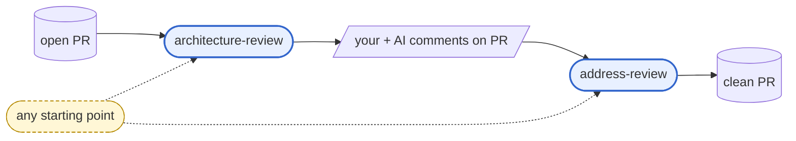

#### Sequence diagram

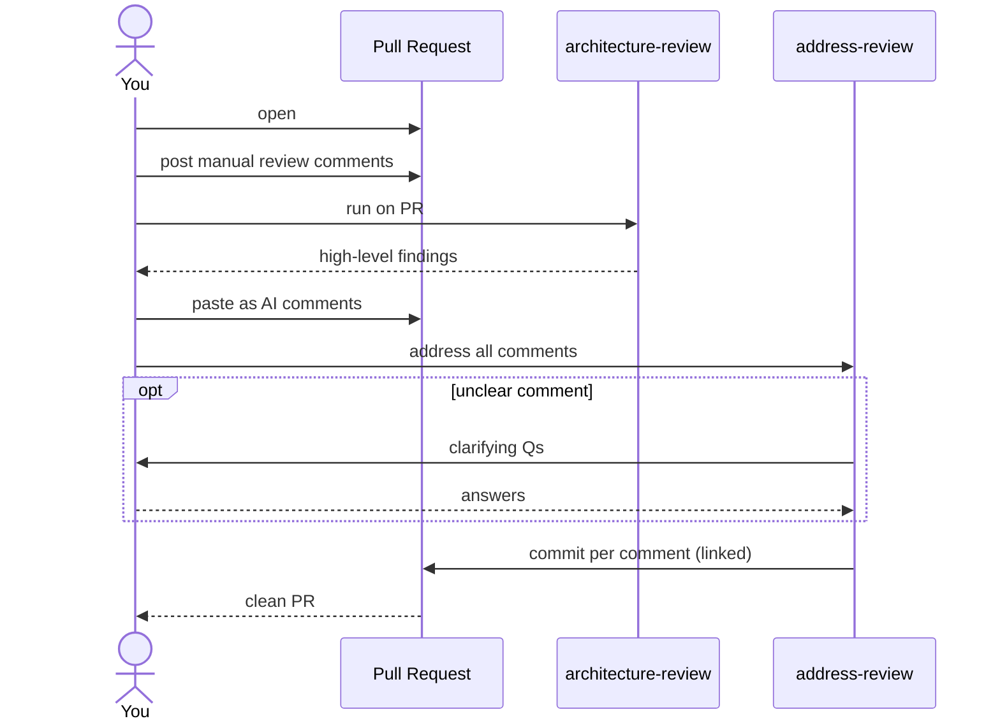

#### State diagram

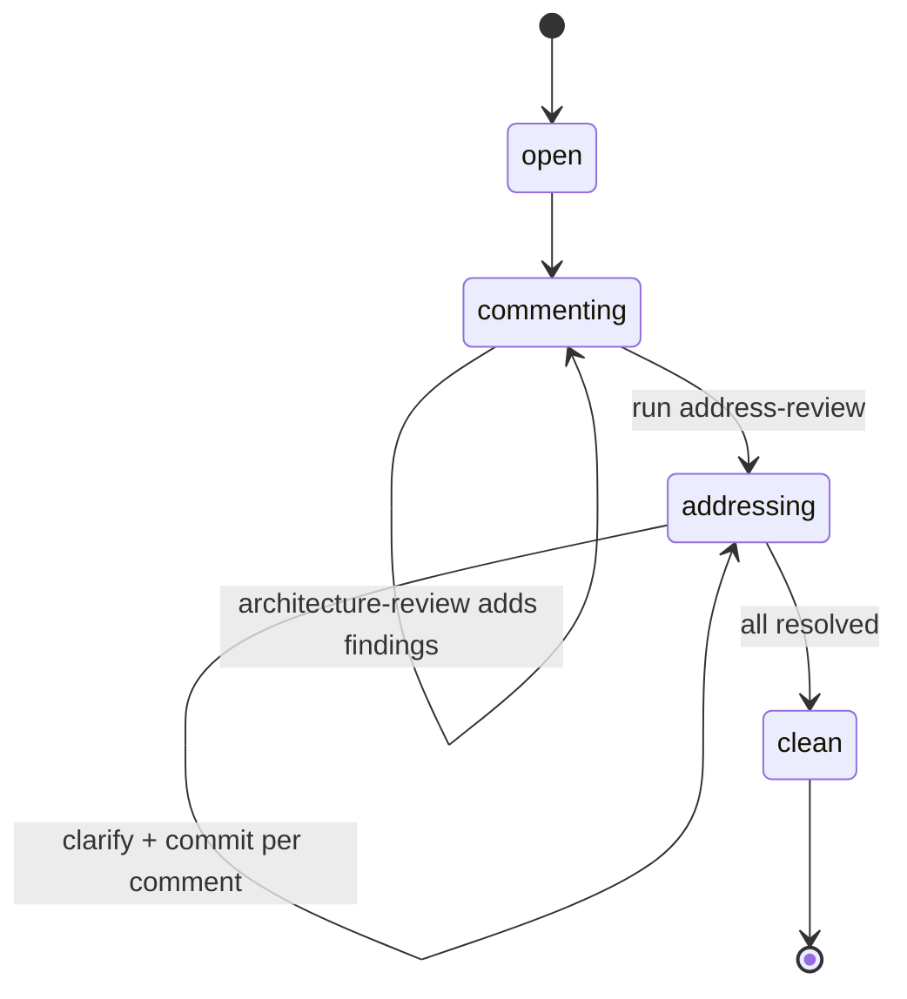

#### Mindmap

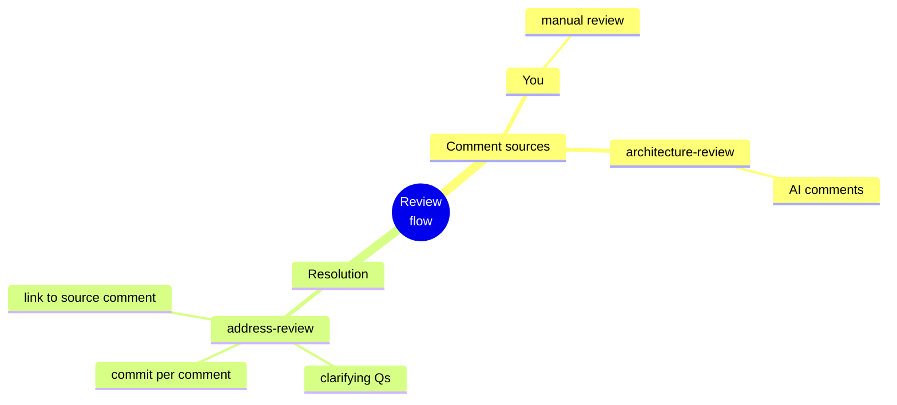

#### Gantt

```mermaid
gantt
    title Review flow ordering
    dateFormat  X
    axisFormat  %s
    PR opened              :a1, 0, 1
    your review comments   :a2, after a1, 1
    architecture-review    :a3, after a1, 1
    paste AI comments      :a4, after a3, 1
    address-review    :a5, after a4, 1
    clean PR               :a6, after a5, 1
```

#### gitGraph (commits per comment)

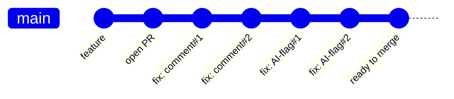

#### Block diagram

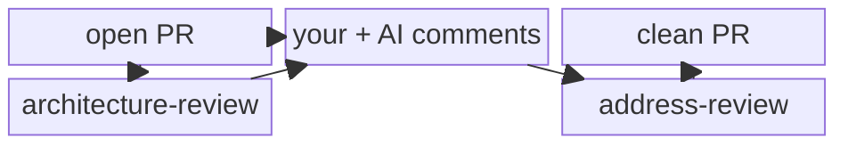

#### Class diagram (skill contracts)

```mermaid
classDiagram
    class architecture_review {
        +in: open PR
        +out: AI comments (high-level)
        +scope: arch / cross-cutting
    }
    class address_pr_comments {
        +in: PR + all comments
        +out: linked commits
        +may: ask clarifying Qs
        +may: skip non-applicable
    }
    architecture_review ..> address_pr_comments : feeds comments
```

#### Timeline

```mermaid
timeline
    title Review flow as timeline
    Open    : PR pushed
    Comment : your manual review
            : architecture-review run
            : AI comments pasted on PR
    Address : address-review
            : clarify if needed
            : commit per comment
    Done    : clean PR
```

</details>

